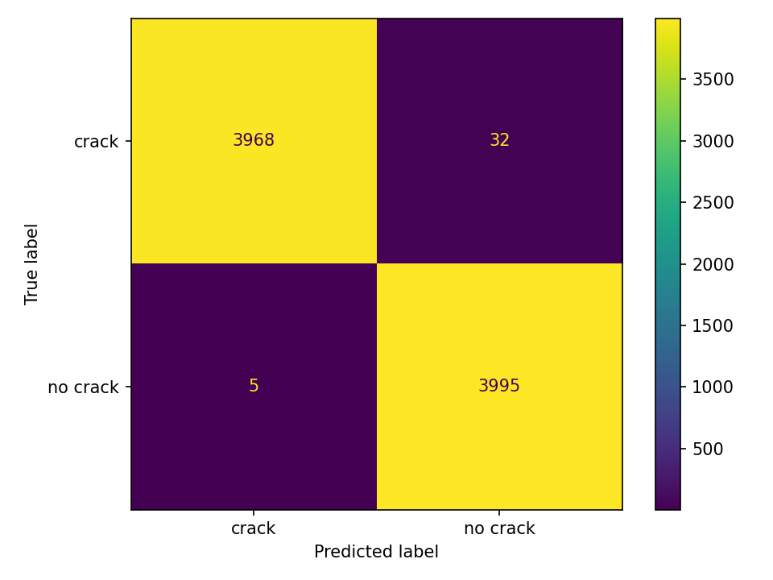

# VisionTwin AI

An AI-assisted infrastructure inspection and Digital Twin-style **decision-support prototype**. Upload a surface image, run explainable OpenCV processing and ResNet18 classification, associate the result with an asset component, and turn it into a risk level, health score, recommended action, inspection history, and downloadable engineering summary.


> **Scope:** this is a Digital Twin-style concept demonstration—not a full BIM, LiDAR, structural assessment, or safety certification system.

## Why this fits applied AI and Digital Twin roles

VisionTwin AI demonstrates the useful seam between ML research and engineering delivery: Computer Vision, OpenCV, ResNet18 transfer learning, Model Validation, Digital Twin Concepts, AI Dashboard Integration, Decision Support, and an MLOps-ready workflow. The component map shows how model output can become asset context and an inspection priority rather than remain an isolated prediction.

The prototype supports inspection prioritisation: it helps a maintenance team decide what to review first. It does **not** replace civil or structural engineers, site investigation, or a certified structural assessment.

## Decision-support workflow

- Classifies each image as crack or no crack and records model confidence.
- Converts inference into Low, Medium, High, or Critical risk with a recommended response.
- Maintains a session-local React inspection history and component-level condition state for Roof, Wall A, Wall B, and Floor.
- Calculates building health, open issues, and high-risk areas from the latest component inspections.
- Returns an OpenCV evidence overlay, candidate crack area, and visual evidence score for interpretability.
- Generates a downloadable HTML inspection report with an explicit engineer-review disclaimer.

## Architecture

```text
Public concrete crack images
          │
          ▼
 OpenCV preprocessing ──► ResNet18 training ──► validation reports
 resize · gray · blur          │                 accuracy · P/R/F1
 Canny · threshold · contour   ├──► MLflow       confusion matrix
                               ▼
                       model checkpoint
                               │
User image ──► React ──► FastAPI /predict ──► prediction + confidence
                 │                                  │
                 └──── Digital Twin-style asset view ◄──┘
                       Roof · Wall A · Wall B · Floor
```

## Quick start with Docker

Requirements: Docker Desktop and Docker Compose.

```bash
git clone <your-repository-url>
cd vision-twin-ai
docker compose up --build
```

Open `http://localhost:5173`; API docs are at `http://localhost:8000/docs`. If no checkpoint exists, the API returns a clearly identified `demo_heuristic` result so the product flow remains demonstrable. Train the model for actual ResNet18 inference.

## Local development

Use Python 3.11. From the project root:

```bash
python -m venv .venv
# Windows: .venv\Scripts\activate
# macOS/Linux: source .venv/bin/activate
pip install -r ml/requirements.txt -r backend/requirements.txt
uvicorn backend.app.main:app --reload
```

In another terminal:

```bash
cd frontend
npm install
npm run dev
```

For local quality checks, install `backend/requirements-dev.txt`, then run `ruff check backend ml` and `pytest backend/tests`.

## Dataset and directory layout

Use the public **Concrete Crack Images for Classification** dataset (40,000 images, balanced positive/negative examples), available through Kaggle. Accept its license/terms, download it locally, and split images into:

```text
data/
├── train/
│   ├── crack/
│   └── no_crack/
└── val/
    ├── crack/
    └── no_crack/
```

Keep `data/` out of Git. A simple 80/20 stratified split is sufficient for this demonstration. The folder names are intentional: `ImageFolder` maps `crack` to class 0 and `no_crack` to class 1.
A helper script does the split for you. Point `--src` at the folder that contains the `Positive` and `Negative` folders:

```bash
python split_data.py --src "path/to/folder"
```

## Train and track an experiment

```bash
python ml/train.py --data-dir data --epochs 3 --batch-size 16
mlflow ui
```

Training freezes the pretrained ResNet18 feature extractor and learns a two-output classification head. It writes `models/resnet18_crack_classifier.pt`, logs parameters, loss, final metrics, the PyTorch model, and report artifacts to MLflow. Visit `http://localhost:5000` for the local MLflow UI.

## Model validation metrics

Measured on 8,000 held-out validation images (4,000 per class) after 3 epochs with a frozen ResNet18 backbone and an 80/20 stratified split (seed 42). The `crack` class is treated as the positive class.

| Metric (crack class) | Value |
|---|---|
| Accuracy | 99.54% |
| Precision | 99.87% |
| Recall | 99.20% |
| F1-score | 99.54% |



Confusion matrix: 3,968 true positives, 32 false negatives, 5 false positives, 3,995 true negatives.

For a safety-oriented inspection tool the important number is the 32 missed cracks, which is higher than the 5 false alarms. A lower decision threshold would trade a few extra false alarms for fewer missed cracks, which is the right direction when a human reviews flagged items.

**Caveats:** this public dataset is clean and homogeneous, so these results demonstrate the pipeline rather than real-world performance. Random image-level splitting can also place near-identical crops in both train and validation sets, which may inflate scores. There is no separate test set.

The validation step also writes `reports/metrics.json`, `reports/classification_report.txt` and `reports/confusion_matrix.png` (Git-ignored; a copy of the matrix is stored in `docs/`).

## OpenCV pipeline

`ml/preprocess.py` is shared by training support and inference. It resizes to 224×224, converts to grayscale, applies Gaussian blur, extracts Canny edges, computes Otsu thresholding, and detects external contours. The API returns contour count, edge-pixel count, threshold mean, and dimensions as a concise, explainable preprocessing summary. ResNet18 receives the resized RGB image; the handcrafted stages provide inspection evidence rather than replacing learned features.

## MLOps choices

- Pinned Python dependencies and deterministic random seeds improve repeatability.
- MLflow records parameters, training loss, validation metrics, checkpoint, and reports.
- Model and report directories make artifact ownership explicit.
- Docker Compose provides consistent API/dashboard startup.
- GitHub Actions runs Ruff, API tests, and the production frontend build.
- A model-source field prevents the UI fallback from being confused with trained inference.
- The dashboard exposes model version, local inference type, validation coverage, and honest `MLflow-ready` lifecycle metadata rather than claiming a production registry.

## API example

```bash
curl -X POST http://localhost:8000/predict -F "file=@inspection.jpg"
```

```json
{
  "prediction": "crack",
  "confidence": 0.91,
  "model_source": "resnet18",
  "preprocessing": {
    "original_width": 640, "original_height": 480,
    "resized_width": 224, "resized_height": 224,
    "edge_pixels": 3812, "contour_count": 47, "threshold_mean": 133.4,
    "detected_crack_area_percent": 1.84,
    "visual_evidence_score": 73.2
  },
  "processed_image": "data:image/jpeg;base64,<encoded edge image>",
  "evidence_image": "data:image/jpeg;base64,<encoded overlay>"
}
```


## Repository map

```text
backend/    FastAPI service, typed schemas, inference, tests
ml/         OpenCV preprocessing, training, evaluation
frontend/   React + TypeScript asset dashboard
models/     generated model checkpoints (Git-ignored)
reports/    generated validation artifacts (Git-ignored)
```

## Responsible use

This prototype supports screening and portfolio discussion only. A prediction must not replace inspection by a qualified engineer.
